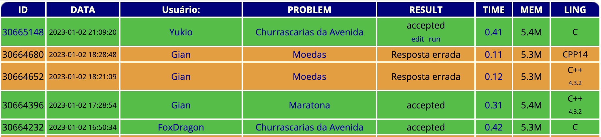

Temas:
 - Grafos-3_Resolusão_de_problemas

# Problemas de Grafos 2

**Número da Lista**: 25 
**Conteúdo da Disciplina**: Dividir e conquistar, Mediana das medianas, Par de pontos mais próximos, contagem de inversões. 

## Alunos
|Matrícula | Aluno |
| -- | -- |
| 18/0068229  |  Victor Yukio Cavalcanti Miki |
| 18/0016067  |  Erick Levy |

## Sobre 
Resolvemos optar por realizar 4 questões sobre a matéria de Grafo 3. você pode encontrar o código fonte das questão em cada uma das pastas que contêm um READEME.md explicando sobre a questão com o link no repositório.

## Screenshots

## Instalação ˜`
**Linguagen(s)**: c++, c  

instalar g++ e gcc compiler

## Uso 
Dentro de cada pasta ira conter um README para cada problema e como rodar em seu computador.

## Outros 
Obrigado!